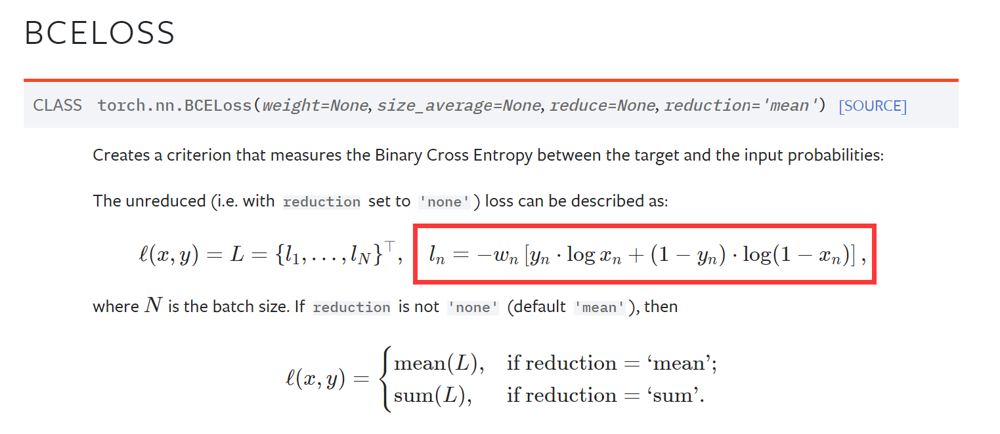
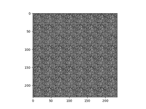
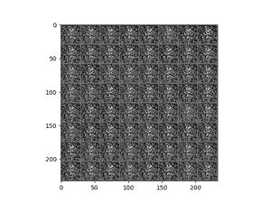
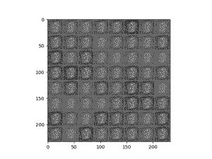

# 利用GAN生成MNIST手写体数字
- GAN，（Generative adversarial network，生成对抗神经网络）是Ian J. Goodfellow在2014年提出的神经网络模型，后来其各种衍生模型在深度学习领域取得了相当成功的结果，主要在**图像生成领域**取得了成功，是一种自监督的模型框架。。
  - [《Genrative Adversarial Nets》论文链接](https://proceedings.neurips.cc/paper/2014/file/5ca3e9b122f61f8f06494c97b1afccf3-Paper.pdf)
  - 这篇论文非常关注数学推导的证明，如果你不太关心这部分，或者数学基础较差也不用担心。论文浅尝辄止即可，只要掌握大致的逻辑也能书写出这个模型的代码。
- MNIST，一个经典的手写体数字数据集，训练集有60000个数字，测试集有10000个数字，基本均匀分布在0~9之间。
  - [官网链接](http://yann.lecun.com/exdb/mnist/)
  - 在Pytorch中也可以通过如下方式快速导入数据集：
    ```python
    from torchvision import datasets, transforms
    # 对于数据集进行的变换，主要是将0~255的数据转化为Tensor并映射到0~1的范围内
    transform = transforms.Compose([
        transforms.ToTensor(),
        transforms.Normalize(mean=[0.5,0.5,0.5], std=[0.5,0.5,0.5]),

    ])
    BATCHSIZE = 128
    # 实际导入数据集的语句，如果检索到本地没有数据的话，会自动从官网下载相应的数据集并进行预处理
    data_train = datasets.MNIST(root='./data/', transform=transform, train=True, download=True)
    data_test = datasets.MNIST(root='./data/', transform=transform, train=False)
    # 构建随机采样Batch的dataloader
    dataloader_train = DataLoader(dataset=data_train, batch_size=BATCHSIZE, shuffle=True)
    dataloader_test = DataLoader(dataset=data_test, batch_size=BATCHSIZE, shuffle=True)
    ```
## 核心概念
GAN的核心就在于如下两点：
- 构建一个生成器，试图从“先验分布”生成一个所需的目标图片
- 构建一个判别器，试图区分一张图片是来自于生成器，还是原始数据集

> 先验分布如果你不好理解的话，可以认为是从“一堆随机数”（比如正态分布的向量）中构建生成目标。
> 之所以这么做的原因，是因为我们需要确保生成的图片具有一定的随机性，不能千篇一律，而随机的噪声则创造了这个条件，本例中选择了正态分布的100维的向量（`torch.randn(<image_number>, 100)`作为先验分布进行生成.

基于这两个目标，我们需要对二者进行分别优化，这里首先们观察论文中提出的优化算法：


基本的逻辑是，先采样训练判别器，再采样训练生成器。论文中强调了普遍来说判别器较为**难拟合**，需要以训练多次判别器，再训练一次生成器的模式展开。**然而**，在本例中，生成器与判别器1:1的训练关系是就足以拟合模型。

在实践中，这上文的梯度函数基本是以交叉熵的二分形式构建的，自然该损失函数和反向传播可以通过`BCEloss`（Binary Cross Entropy loss）来实现，无需手动定义损失函数。二者基本从数学角度是等价的（此处不过多展开证明）。



如果观察代码中具体的`loss = criterion(...)`可以发现代码中有如下两个部分：
- 在判别器训练时，损失函数是**真实**的结果向**真实**的标签（全是1的张量）拟合；生成的结果向错误的标签（全是0的张量）拟合：
  ```python
    # True img loss
    predict = D(true_img)
    true_loss = criterion(predict, true_labels)
    # Fake img loss
    predict = D(fake_img)
    fake_loss = criterion(predict, fake_labels)
    # backpropagation and Optimize 
    total_loss = true_loss + fake_loss
  ```
- 在生成器训练时，损失函数是将生成的结果，向**真实的标签**拟合，和判别器时的直觉相反
    ```python
    fake_img = G(noise) #从噪声中生成假图片
    predict = D(fake_img) # 利用判别器预测
    fake_loss = criterion(predict, real_label)  # 注意这里目标是“真标签”
    ```
其实很好理解，判别器的目标是为了欺骗生成器，自然它的优化目标逻辑是与生成器相反的，对应`Algorithm`图中的**绿色框**，一个是上升的梯度，一个是下降的梯度。

其余的问题，按部就班书写逻辑即可，需要多多研究论文和其他人的博客以加深理解。

--------------------------

## 训练讨论
在本仓库中目前有两个样例，分别代表不同的训练逻辑：
- [1_GAN_epoch2epoch.py](1_GAN_epoch2epoch.py)执行的逻辑是：
  - 训练的单位以整个Epoch展开，首先用n个epoch训练判别器，然后再用一个epoch的数据量随机生成信息训练生成器。其中n是常量，可以手动设置。
- [2_GAN_batch2batch.py](2_GAN_batch2batch.py)
  - 训练的单位以Batch展开，对于每一个Batch，计算判别器的损失并传播，然后计算生成器的损失并传播，再进行下一个batch的训练。

这其中第一个是“粒度”较粗的训练，而第二个是“粒度”较细的训练。第二种的迭代会更加频繁，以一种“你刚学完，我就跟进”的形式展开。

相比之下，“粒度小”带来的好处就是生成的图片会更加的泛化，生成的图片会倾向于不同的数字和目标。

而“粒度大”的图片，则更加倾向于表达样本总体的特征，比如后面的样例中发现生成的图片大多倾向于某一个数字的形式，实际上可能并不是我们想要的。
总的来说，在没有引入`BatchNormalization`的情况下，还是需要非常关注训练单元的“粒度”的。

- 训练结果如下：
  
|类型|1~100Epoch训练结果图片|
|-|-|
|**D** 训练1 Epoch对 **G** 训练1 Epoch||
|**D** 训练2 Epoch对 **G** 训练1 Epoch||
|**D** 训练1 Batch 对 **G** 训练1 Batch||


在这个样例中，我们通过实验认为，`Batch to Batch`的方法是更为有效的，更加符合期望的。